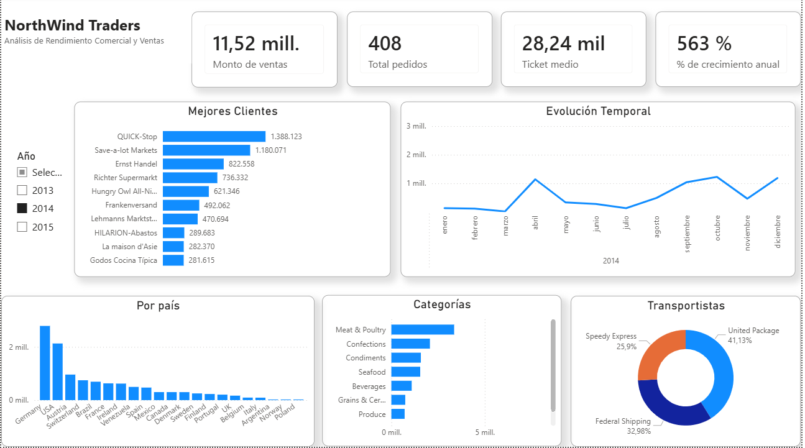

# 📊 Dashboard de Análisis de Ventas Globales: Northwind Traders

## 📝 Descripción del Proyecto
Este proyecto simula un escenario empresarial real donde se transforma un set de datos transaccional complejo (basado en la base de datos de Northwind) en un modelo de datos analítico e interactivo en Power BI. El objetivo es proporcionar al equipo directivo visibilidad completa sobre los ingresos, el rendimiento de los transportistas y el comportamiento de los clientes.

---

## 📸 Vista General del Dashboard




---

## 🛠️ Herramientas y Habilidades Utilizadas
* **Power Query (ETL):** Limpieza de datos, desnormalización de tablas (combinación de consultas para Categorías y Productos), normalización de descuentos y cálculo de importes netos.
* **Modelado de Datos:** Creación de un **Modelo en Estrella (Star Schema)** con relaciones de 1 a varios (`1:*`). Diseño de una **Tabla Calendario** a medida mediante DAX.
* **DAX Avanzado:** Creación de medidas e indicadores clave (KPIs) y aplicación de **Inteligencia de Tiempo** (Time Intelligence) para el análisis de crecimiento interanual (YoY).
* **Diseño UX/UI:** Aplicación de mejores prácticas de diseño (limpieza de ejes, formatos dinámicos y control de errores en tarjetas mediante `HASONEVALUE`).

---

## 📐 Arquitectura del Modelo de Datos
El modelo se construyó bajo un enfoque de **Modelo en Estrella** para optimizar el rendimiento de las consultas y garantizar la escalabilidad del informe:

* **Tabla de Hechos:** `Fact_Ventas` (Pedidos e importes netos).
* **Tablas de Dimensiones:** `Dim_Clientes`, `Dim_Productos`, `Dim_Empleados`, `Dim_Transportistas` y `Dim_Calendario`.

---

## 💡 Principales Métricas Implementadas (DAX)

### 1. Ventas Totales (Monto Neto)
Calculado de forma eficiente tras la optimización en Power Query:
```dax
Ventas_Totales = SUM(Fact_Ventas[Importe_Neto])
