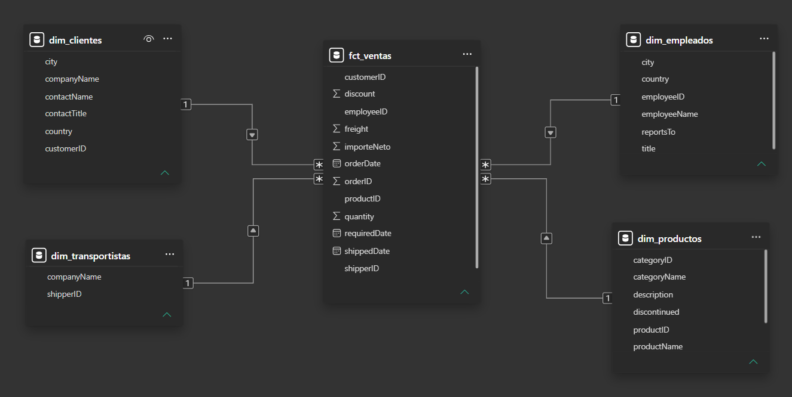

# 📊 Dashboard de Análisis de Ventas Globales: Northwind Traders

## 📝 Descripción del Proyecto
Este proyecto simula un escenario empresarial real donde se transforma un set de datos transaccional complejo (basado en la base de datos de Northwind) en un modelo de datos analítico e interactivo en Power BI. El objetivo es proporcionar al equipo directivo visibilidad completa sobre los ingresos, el rendimiento de los transportistas y el comportamiento de los clientes.

---

## 📸 Vista General del Dashboard


---

## 🛠️ Herramientas y Habilidades Utilizadas
* **Power Query (ETL):** Limpieza de datos, desnormalización de tablas (combinación de consultas para Categorías y Productos), normalización de descuentos y cálculo de importes netos.
* **Modelado de Datos:** Creación de un **Modelo en Estrella (Star Schema)** con relaciones de 1 a varios (`1:*`). Diseño de una **Tabla Calendario** a medida mediante DAX.
* **DAX Avanzado:** Creación de medidas e indicadores clave (KPIs) y aplicación de **Inteligencia de Tiempo** (Time Intelligence) para el análisis de crecimiento interanual (YoY).
* **Diseño UX/UI:** Aplicación de mejores prácticas de diseño (limpieza de ejes, formatos dinámicos y control de errores en tarjetas mediante `HASONEVALUE`).

---

## 📐 Arquitectura del Modelo de Datos
El modelo se construyó bajo un enfoque de **Modelo en Estrella** para optimizar el rendimiento de las consultas y garantizar la escalabilidad del informe:

* **Tabla de Hechos:** `Fact_Ventas` (Pedidos e importes netos).
* **Tablas de Dimensiones:** `Dim_Clientes`, `Dim_Productos`, `Dim_Empleados`, `Dim_Transportistas` y `Dim_Calendario`.
* 

---

## 💡 Principales Métricas Implementadas (DAX)

El proyecto cuenta con un modelo de cálculo avanzado optimizado para el rendimiento del motor VertiPaq. A continuación se destacan las métricas clave que articulan la inteligencia de negocio del informe:

### 1. Ventas Totales (Monto Neto)
Calculado de forma eficiente sumando la columna de importe neto previamente procesada, normalizada y saneada en la etapa de ETL (Power Query):
```dax
Monto de ventas = SUM(fct_ventas[importeNeto])
```
### 2. Ventas del Año Anterior (Time Intelligence)
Métrica de transición que desplaza el contexto de filtrado temporal exactamente un año atrás para permitir comparaciones homólogas (Year-Over-Year):
```dax
Ventas año anterior = 
CALCULATE(
    [Monto de ventas],
    SAMEPERIODLASTYEAR(dim_calendario[Date])
)
```
### 3. Porcentaje de Crecimiento Anual (YoY %) con Control de Contexto
Implementa una estructura condicional defensiva mediante HASONEVALUE. Si el usuario visualiza el reporte de forma agregada (todos los años seleccionados), la tarjeta se protege y devuelve un valor en blanco (BLANK()) para evitar inducir a error con métricas históricas acumuladas sin sentido de negocio. Solo se activa cuando el contexto detecta un único año filtrado:
```dax
% de crecimiento anual = 
IF(
    HASONEVALUE(dim_calendario[Año]),
    DIVIDE(([Monto de ventas] - [Ventas año anterior]), [Ventas año anterior],0),
    BLANK()
)
```
---

## 📊 Análisis Estratégico e Insights de Negocio (Enfoque Ejecutivo)

Tras consolidar el modelo de datos y analizar el comportamiento histórico de Northwind Traders, se han detectado tres hallazgos críticos para la toma de decisiones estratégicas:

### 1. 🎯 Diagnóstico de Crecimiento Interanual (Evolución Temporal)
Al analizar la línea de tendencia histórica, el negocio muestra un comportamiento muy particular:
* **Fase de Arranque (2013):** La compañía inicia operaciones registradas en julio de 2013 con un volumen modesto pero constante (entorno a los 100K mensuales).
* **Consolidación (2014):** Se observa un pico estacional agresivo en **abril de 2014 (1,1 mill.)**, seguido de una estabilización y un crecimiento sostenido en el último trimestre, cerrando octubre en 1,3 mill.
* **Explosión Comercial (2015):** El año 2015 marca el récord histórico de la compañía con un pico vertical sin precedentes en **febrero llegando a los 2,5 mill.** de facturación, consolidando un **crecimiento anual del 71,97%** en los periodos activos. 
* *Recomendación estratégica:* Investigar qué campaña comercial, rotura de stock de la competencia o política de precios provocó el éxito de febrero de 2015 para estandarizar ese comportamiento el resto de meses.

### 2. ⚖️ Riesgo de Concentración de Clientes y Dependencia Logística
El análisis cruzado de rankings revela vulnerabilidades operativas en la cadena de valor:
* **Riesgo en Clientes:** El Top 3 de clientes (`Hungry Owl All-Night Grocers` con 2,4M, `Save-a-lot Markets` con 2,4M y `QUICK-Stop` con 2,1M) acumula una porción masiva de los 22,80M totales del negocio. Perder a uno solo de estos tres clientes supondría un impacto crítico de casi el 10% de la facturación global.
* **Monopolio Logístico:** A nivel de distribución, el transportista `United Package` controla el **48,84% del mercado** (11,13 mill.), facturando prácticamente lo mismo que sus dos competidores juntos (`Federal Shipping` y `Speedy Express`). 
* *Recomendación estratégica:* Se sugiere diversificar los envíos o renegociar tarifas con `Federal Shipping` para mitigar el riesgo operativo de que una huelga o caída de servicio de `United Package` paralice la mitad de las entregas de la empresa.

### 3. 🌍 Concentración Geográfica del Mercado
Aunque la compañía vende a nivel global, los ingresos reales están altamente centralizados:
* **Alemania y Estados Unidos** lideran la tabla por una diferencia abismal, rozando los 5 millones de facturación cada uno. 
* A partir del tercer competidor (Irlanda), el volumen cae drásticamente por debajo de los 3 millones, y se atomiza en mercados muy pequeños en la cola del gráfico (como Argentina, Noruega o Polonia, que apenas mueven la aguja del negocio).
* *Recomendación estratégica:* Evaluar si los mercados de la cola sufren por falta de penetración de marca o por costes logísticos elevados, y valorar la redirección de esos esfuerzos de marketing para blindar el liderazgo en la región DACH (Alemania/Austria) y Norteamérica.
